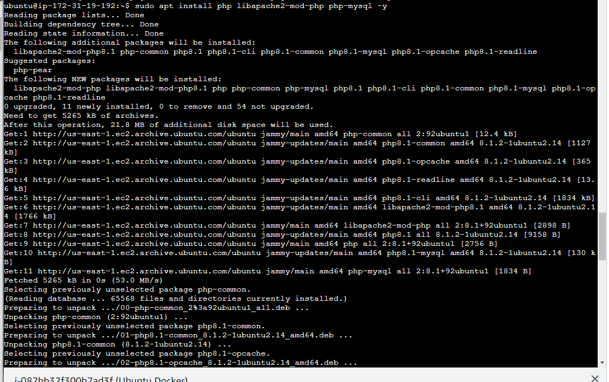
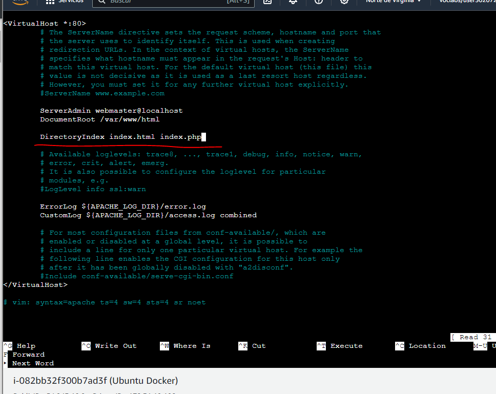
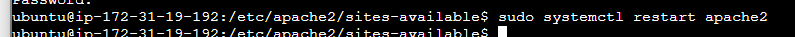
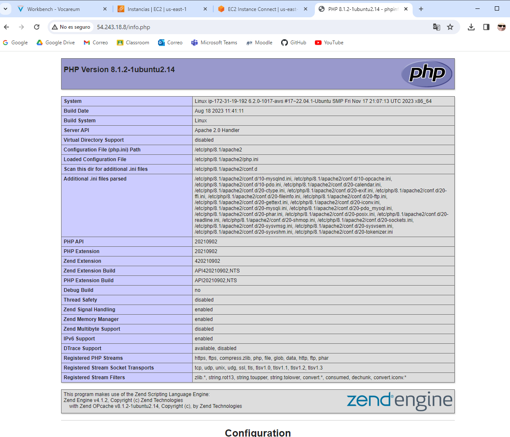
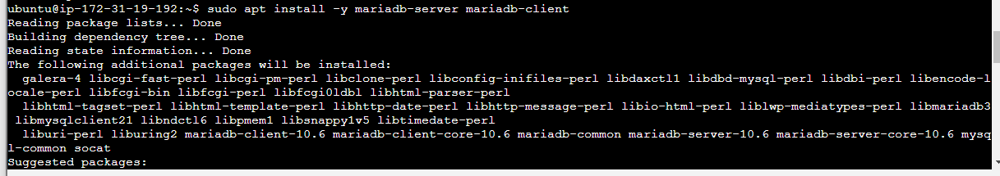
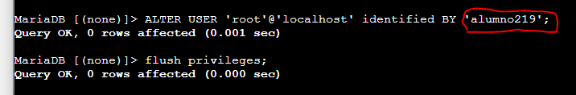
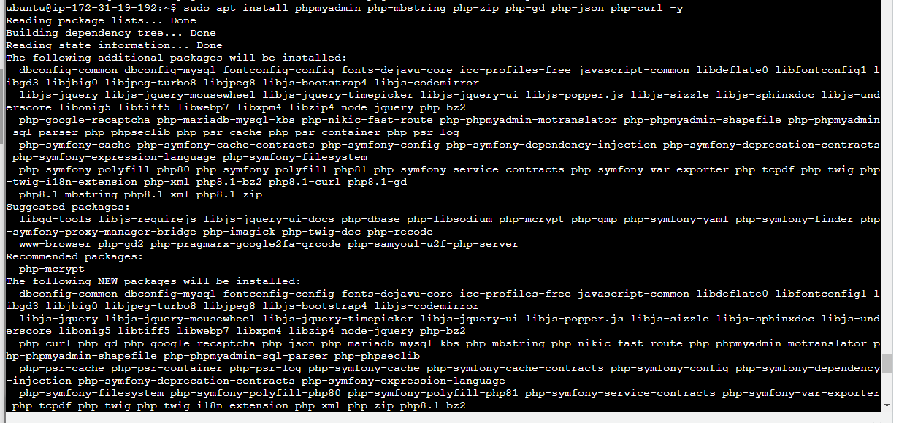
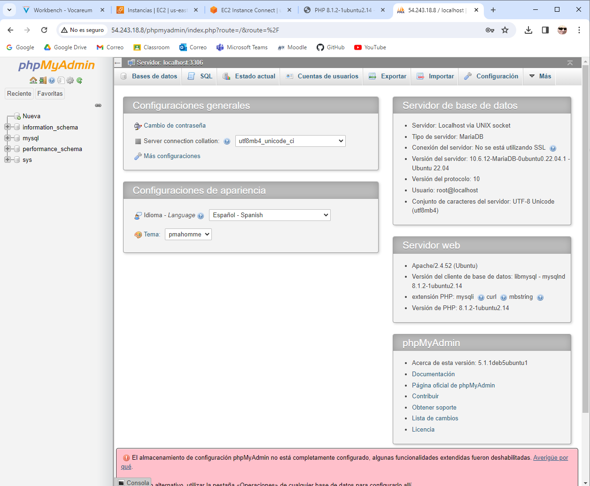

# ***INSTALACIÓN LAMP EN UBUNTU***
## Antes de empezar, debemos instalar **apache2** y **PHP**.

## Editamos el fichero *000-default.conf*, que sirve para crear el sitio web.

## Reiniciamos **apache2** para que se apliquen los cambios realizados en el paso anterior.

## Creamos una pagina por defecto, que será *info.php* y buscamos en el navegador para ver si esta todo correcto.

## Ahora toca instalar **MariaDB**.

## Una vez instalado, accedemos a la consola y cambiamos la contraseña de root.

## Para finalizar, toca instalar **PHPMyAdmin**.

## Por ultimo comprobamos desde el navegador que **PHPMyAdmin** se ha instalado correctamente.

